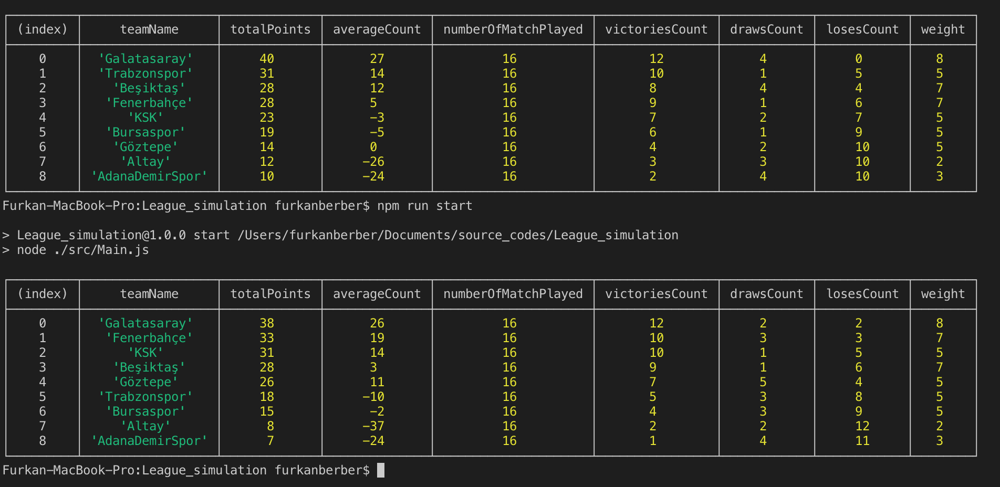

# Soccer League Simulation

#### About Soccer League Simulation
Soccer League Simulation is a basically a match simulator. However, it does these simulations with weighted randomizing. After that, it makes every team to match with each other twice. Lastly, it compares them by total point unless their point are equal. If that is the case, it compares their averages.

#### Used Technologies
* Typescript
* Javascript
* TSlint
* Installation

-> Change Directory
```
cd /var/www
```
->Clone the repository
```
git clone https://github.com/frknbrbr/Soccer_League.git .
```
-> Install Packages
```
npm install
```
-> Start App
```
cd /var/www
npm run start
```
-> If you want to compile it by yoursef(However, it is already compiled).
```
cd /var/www
npm run compile
```



